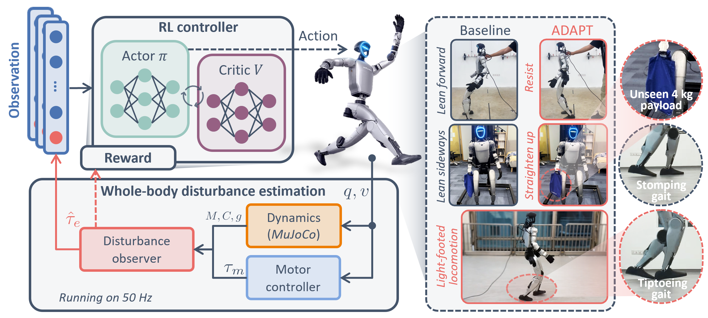

# ADAPT: Analytical Disturbance-Aware Policy Training for Humanoid Locomotion

Compact implementation of ADAPT: the momentum observer, five core training tasks,
pretrained policies, MuJoCo deployment, G1 deployment adapters, and observer monitoring.
This repository does not include scripts for reproducing the paper's experiments or figures.
FAST-LIO source/Docker will be added separately later; real deployment currently requires
an externally running odometry service.

Project page: [ADAPT](https://blyu413.github.io/adapt-locomotion/)

Paper: [arXiv:2606.16542](https://arxiv.org/abs/2606.16542)



## Abstract

Humanoids deployed in human-centered environments must handle force-interactive tasks, where external contacts introduce unexpected disturbances that disrupt locomotion accuracy and stability. Existing learning-based approaches rely on broad domain randomization, task-specific force objectives, or learning-based force estimators from motion history, each of which compromises accuracy, task transferability, or out-of-distribution robustness. We present Analytical Disturbance-Aware Policy Training (ADAPT), a framework that equips humanoid policies with a physically grounded disturbance observer. ADAPT estimates residual force/torque online from accessible robot dynamics without requiring force/torque sensors, feeds these estimates directly into the policy, and uses them as a physics-derived signal for robust behavior under external forces, payloads, and contact-induced disturbances. Experiments on a Unitree G1 humanoid show accurate disturbance prediction, stronger robustness than a proprioception-only baseline, improved velocity tracking under out-of-distribution disturbances, and the ability to encourage lighter locomotion by penalizing inferred lower-body disturbances.

## Quick start

Supported installation target: **Linux x86-64, Python 3.10**. The simulation demo
runs on CPU and does not require PyTorch, mjlab, the Unitree SDK, or FAST-LIO.
Install [uv](https://docs.astral.sh/uv/getting-started/installation/), clone this
repository, and run the following from its root:

```bash
uv sync --locked
uv run --no-sync python deployment/deploy_mujoco_mjlab.py --policy adapt
```

For a headless machine:

```bash
uv run --no-sync python deployment/deploy_mujoco_mjlab.py --policy adapt --headless --seconds 10
```

Select `--policy baseline` or `--policy lightstep` for the other released policies.
Velocity commands use `--command VX VY WZ` in m/s, m/s, rad/s; default is `0.8 0 0`.
Five `.pt`/`.onnx` pairs and their deployment JSON files are included under
[`logs/rsl_rl/4096*1/`](logs/rsl_rl/4096*1/README.md). Keep each ONNX and JSON pair together.

## Components

The code layout follows `humanoid-NDO`, retaining only the selected core components.
Robot assets are grouped under `models/g1/`:

```text
ADAPT/
├── observer/momo.py                # Standalone NumPy observer
├── common/                         # Command helpers, telemetry and paths
├── tasks/momo_task/                 # Five tasks and batched observer in mdp/
├── scripts/                        # Train, two-stage, play, export, monitor
├── deployment/                     # MuJoCo/G1 deployment, policy and LIO
├── models/g1/                      # Deployment XML and required meshes
└── logs/rsl_rl/4096*1/              # Selected original checkpoints + JSON
```

| Component | Location |
| --- | --- |
| Standalone observer | [`observer/momo.py`](observer/momo.py) |
| Tasks and batched observer | [`tasks/momo_task/`](tasks/momo_task/) |
| MuJoCo / G1 deployment | [`deployment/`](deployment/) |
| External LIO and pelvis velocity | [receiver](deployment/fastlio_receiver_ros2.py), [transform](deployment/pelvis_vel_estimator.py) |
| Observer monitoring | [`scripts/momo_realtime_viewer.py`](scripts/momo_realtime_viewer.py), [telemetry](common/telemetry.py) |
| G1 MJCF and meshes | [`models/g1/`](models/g1/README.md) |

### Train or continue a policy

```bash
uv sync --locked --extra train
uv run --no-sync python scripts/train_two_stage.py adapt --num-envs 4096
```

This runs the original Stage 1 walking task and then resumes its checkpoint into
the Stage 2 hand-load task. NVIDIA GPU required; reduce `--num-envs` to fit VRAM.
The other entry points are [`train.py`](scripts/train.py), [`play.py`](scripts/play.py)
and [`export_onnx.py`](scripts/export_onnx.py); use `--help` for their arguments.
Training defaults to local TensorBoard logging; no online account is required.

### Monitor observer signals

```bash
uv sync --locked --extra monitor
uv run --no-sync python scripts/momo_realtime_viewer.py
```

In another terminal:

```bash
uv run --no-sync python deployment/deploy_mujoco_mjlab.py --udp 127.0.0.1:9870 --log outputs/walk.jsonl
```

Existing log files are not overwritten. Offline plotting:

```bash
uv run --no-sync python scripts/momo_realtime_viewer.py --log outputs/walk.jsonl --output outputs/walk.png
```

### Real robot

The G1 adapter in this release is **not hardware-validated**. It defaults to read-only,
requires external LIO, and only creates a command publisher with explicit control
opt-in and gamepad confirmation. Before connecting, verify the G1 hardware revision,
joint mapping, gains and LiDAR frame. Use qualified supervision, a support harness
and an independent emergency stop. Do not run low-level control alongside another controller.

## Installation and validation

Use `uv sync --locked` for the base environment; add `--extra train`,
`--extra robot` or `--extra monitor` as needed. Extras can be combined.
See [source / third-party notices](THIRD_PARTY_NOTICES.md). This is a source-checkout,
editable-install workflow; assets and checkpoints are not bundled into a standalone wheel.
The project license and redistributed asset notices must be finalized before publication.

```bash
uv sync --locked --group dev
uv run --no-sync ruff check observer common deployment scripts tasks
```

Use the headless simulation command above for a basic runtime check;
it does not establish real-robot safety or reproduce the paper's experiments.

## Citation

```bibtex
@misc{lyu2026adapt,
  title={ADAPT: Analytical Disturbance-Aware Policy Training for Humanoid Locomotion},
  author={Bofan Lyu and Jindou Jia and Kuangji Zuo and Yanshuo Lu and Shijia Han and Gen Li and Boyu Ma and Jingliang Li and Geng Li and Jianfei Yang},
  year={2026},
  eprint={2606.16542},
  archivePrefix={arXiv},
  primaryClass={cs.RO}
}
```
